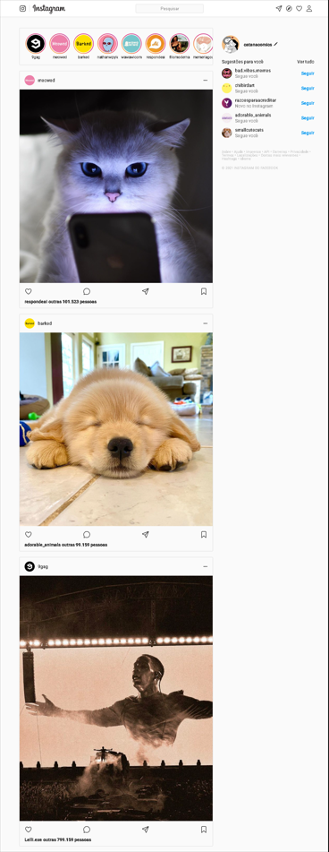

Instagram Clone - React

📌 Sobre o Projeto

Este é um projeto que eu desenvolvi como parte do meu aprendizado em React, implementando uma interface inspirada no Instagram. O foco foi na componentização, estados dinâmicos e boas práticas de desenvolvimento.

🛠️ Tecnologias Utilizadas

React

JavaScript (ES6+)

HTML e CSS

Git e GitHub

🎨 Funcionalidades Implementadas

Interface responsiva para desktop baseada no layout fornecido.

Componentização organizada para facilitar manutenção e reuso de código.

Renderização dinâmica usando map para exibir stories, posts e sugestões de seguidores.

Interação com usuário, incluindo:

Edição do nome de usuário.

Atualização da imagem de perfil.

Curtir/descurtir posts.

Salvar posts.

Atualização dinâmica do número de likes.

📸 Demonstração

📦 Estrutura do Projeto

O projeto é dividido em componentes reutilizáveis:

App

Body

SideBar

NavBar

User

Stories e Story

Posts e Post

Suggestions e Suggestion
